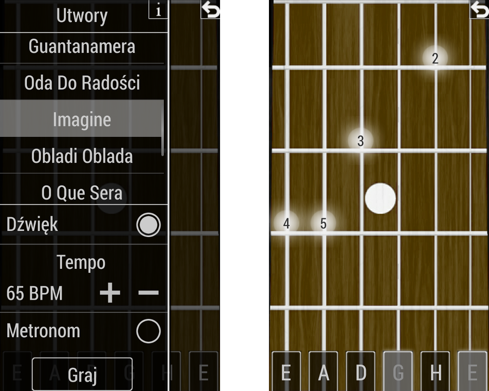

## About ##

This is a mobile application designed to help users play guitar chords as well as songs.

Full documentaion available in polish - <i>Dokumentacja.pdf</i>

External libraries used:

Midi Driver 1.14 - https://github.com/billthefarmer/mididriver

Android MIDI Library - https://github.com/LeffelMania/android-midi-lib